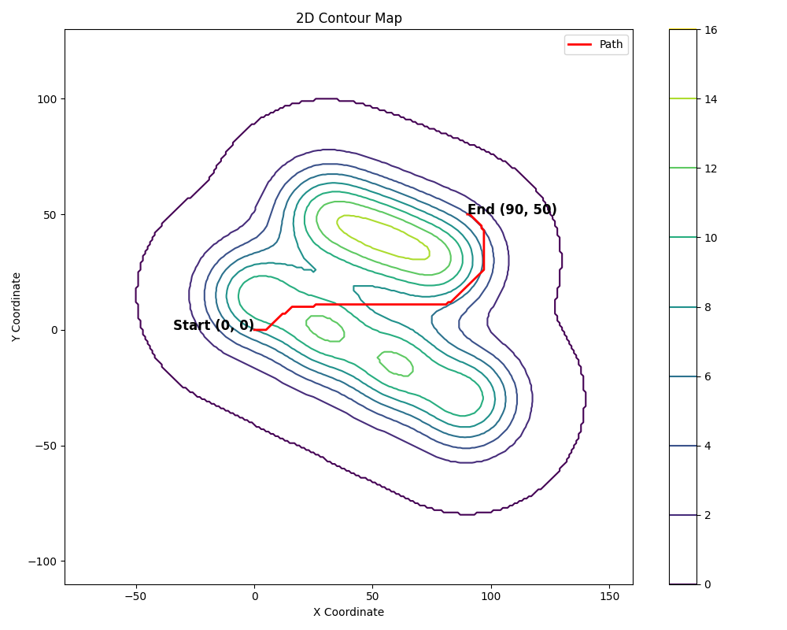
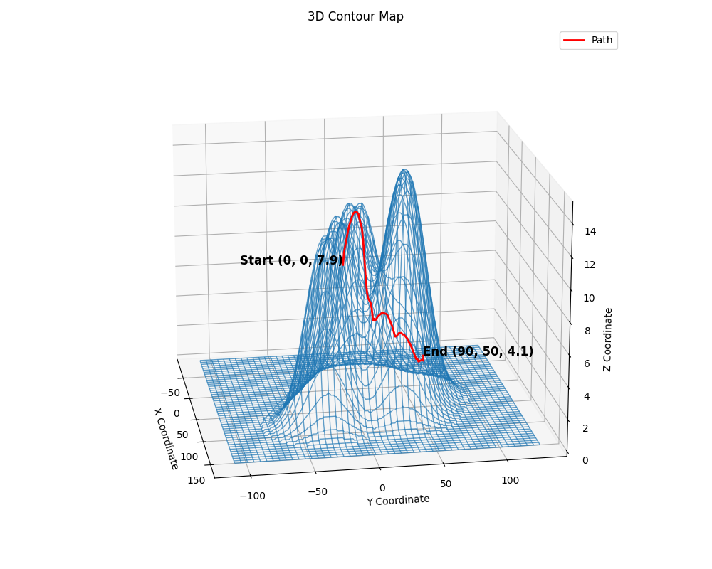
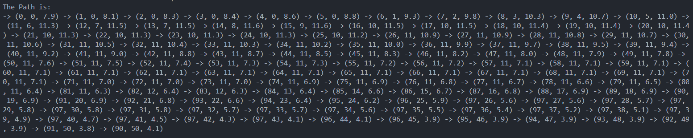

# About The Project
This project started from the [Challenge Of Wits 2023 (Challenge 3)](https://www.dtcareers.gov.sg/files/Challenge3_Answer.pdf). I took on this challenge to learn something new and discovered the Dijkstra and A-star algorithms, which helped me solve the question. To satisfy my curiosity, I added a graph plotting feature as an additional enhancement.

<div style="display: flex; justify-content: space-around; margin-bottom: 16px">
    
    
</div> 
<div>
    
</div>


## Tech Stack
This project is built using:
- [Python](https://www.python.org/)
- [Pandas](https://pandas.pydata.org/)
- [Numpy](https://numpy.org/)
- [Matplotlib](https://matplotlib.org/)

# Getting Started

## Prerequisites 

- Python 3.x and above

## Installation

1. **Clone the repository**
    ```bash
    git clone https://github.com/n1cholasong/challenge-of-wits.git
    cd challenge-of-wits/2023/Challenge3
    ```

2. **Create and activate a virtual environment**
    ```bash
    python -m venv astar-viewer
    astar-viewer\Scripts\activate
    ```

3. **Install dependencies**
    ```bash
    pip install -r requirements.txt
    ```

## Configuration

1. **Set environemnt variables**
    Copy the `.env.example` file to create a new `.env` file:
    ```bash
    cp .env.example .env
    ```

2. **Update the .env file**
    Open the newly created `.env` file in a text editor and set the `ELEVATION_CSV_PATH` variable to the path of your `elevation.csv` file
    ```bash
    ELEVATION_CSV_PATH = "C:/path/to/elevation.csv" # for WindowsOS
    ```

## Running the Project
To run the project, execute the following command:
```bash
python main.py
```